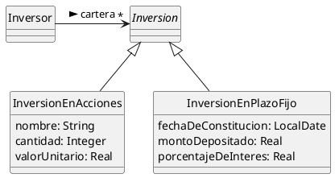

# Ejercicio 3 
---

- Inversor
  - inversiones
- inversiones
  - valor actual
  - inversiones en acciones
  - inversiones en plazo fijo 
- Inversion acciones
  - cantidad
  - nombre 
  - valor unitario
- inversion en plazo fijo
  - monto depositado
  - fecha inicial
  - porcentaje de interes diario
  - porcentaje de interes 


![[Pasted image 20260917195355.png]]

---

# Ejercicio 4 
---

- Persona:
	- Nombre
	- direccion de correo electronico
	- saldo en creditos
	- videos en venta
- video:
  - titulo
  - comentarios
  - descripcion
  - precio en creditos
- comentario: 
  - tectp
  - autor
  - fecha realizado
- compra 
  - Comprador: persona
  - Autor
  - video
  - fecha
  - precio

```plantuml
@startuml
Class Persona {
{field} nombre: string	
{field} direccionDeCorreoElectronico: string
{field} saldoEnCreditos: real
{field} videosEnVenta: video
}

Class video {
{field} titulo: String
{field} comentarios: List<Comentario>
{field} descripcion: String
{field} precioEnCreditos: real
}

Class comentario { 
{field} texto: String
{field} autor: persona
{field} fechaRealizado: date
} 

Class compra { 
{field} comprador: persona
{field} autor: persona
{field} video: video
{field} fecha: date
{field} precio: real
}
@enduml