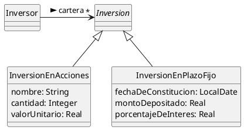
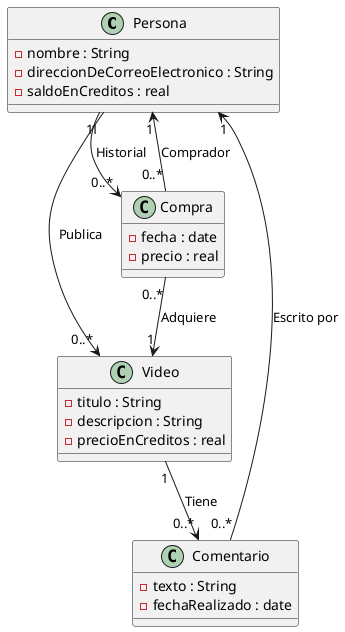

# Ejercicio 3 
---

- Inversor
  - inversiones
- inversiones
  - valor actual
  - inversiones en acciones
  - inversiones en plazo fijo 
- Inversion acciones
  - cantidad
  - nombre 
  - valor unitario
- inversion en plazo fijo
  - monto depositado
  - fecha inicial
  - porcentaje de interes diario
  - porcentaje de interes 

---

# Ejercicio 4 
---

- Persona:
	- Nombre
	- direccion de correo electronico
	- saldo en creditos
- video:
  - titulo
  - descripcion
  - precio en creditos
- comentario: 
  - texto
  - fecha realizado
- compra 
  - fecha
  - precio

## Ejercicio 5
